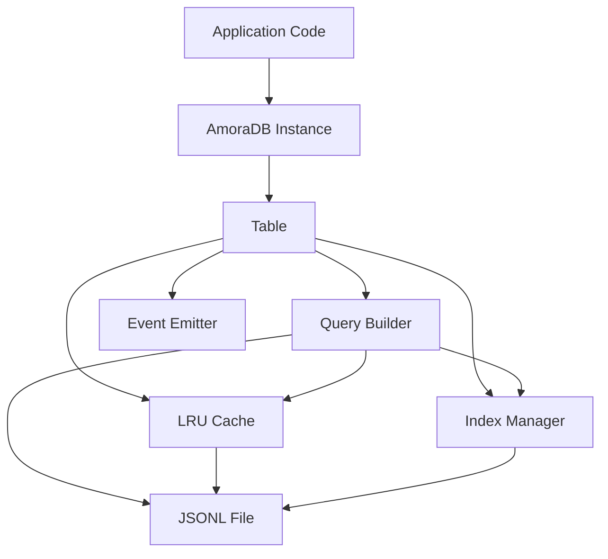

## What is AmoraDB?

AmoraDB is an embedded document database that stores data as JSONL (newline-delimited JSON) files on disk. It provides a chainable query builder, in-memory indexing, an LRU cache, and an event system — all with no external dependencies. Everything runs off Node.js built-ins (`fs`, `path`, `crypto`, `events`, `readline`).

<Note>
AmoraDB requires **Node.js version 14.0.0 or higher** and has **zero external dependencies** for core functionality.
</Note>

## What problems does AmoraDB solve?

AmoraDB addresses the need for persistent data storage in Node.js applications without the overhead of running a separate database server. It eliminates the complexity of:

- Installing and configuring external database systems
- Managing database connections and connection pools
- Dealing with network latency for local data access
- Handling database server dependencies in deployment
- Learning complex database administration

## Key features and benefits

### Zero dependencies

AmoraDB uses only Node.js built-in modules (`fs`, `path`, `crypto`, `events`, `readline`). No external packages to install or manage, reducing your dependency footprint and potential security vulnerabilities.

### MongoDB-like query syntax

If you know MongoDB, you already know AmoraDB. The query language supports familiar operators like `$gte`, `$in`, `$regex`, and more:

```javascript
const results = await users
  .find({ age: { $gte: 18 } })
  .and({ subscription: 'premium' })
  .sort('joinDate', 'desc')
  .limit(20)
  .execute();
```

### File-based storage with JSONL format

Data is stored as JSONL files (one JSON object per line), making it human-readable, easy to backup, and simple to version control. Each record automatically gets metadata fields:

```javascript
{
  _id: "550e8400-e29b-41d4-a716-446655440000",  // UUID v4
  _created: "2024-01-01T00:00:00.000Z",
  _modified: "2024-01-01T00:00:00.000Z",
  // ...your fields
}
```

### Intelligent caching and indexing

AmoraDB includes a built-in LRU cache and automatic index selection. The query engine automatically uses available indices when evaluating conditions, with support for both hash indices (for equality lookups) and sorted indices (for range queries).

<Info>
When a table's total record count fits within the cache size, all records are held in memory. For larger tables, records are loaded on demand and the least recently used entries are evicted.
</Info>

### Batched writes for performance

Inserts are synchronous in-memory and batched to disk asynchronously. This provides fast write operations while ensuring data durability. Updates and deletes are tracked in memory and compacted periodically.

### Event-driven architecture

Both the database and individual tables emit events via Node.js `EventEmitter`, allowing you to react to data changes:

```javascript
users.on('insert', (record) => {
  console.log('New user:', record.name);
});

db.on('ready', (db) => {
  console.log('Database initialized');
});
```

## Use cases

AmoraDB is ideal for applications that need persistent document storage without running a separate database server:

### Electron and desktop applications

Store user preferences, application state, and local data without requiring users to install a database. The file-based storage integrates seamlessly with desktop app architectures.

### Microservices

Each microservice can maintain its own embedded database without the overhead of shared database infrastructure. Perfect for service-local caching and state management.

### CLI tools

Command-line tools can persist data between runs without external dependencies. The lightweight footprint keeps your CLI tools fast and portable.

### Offline-first applications

Build applications that work offline by default. Data is stored locally and can be synced when connectivity is available.

### Development and prototyping

Quickly prototype applications without setting up database infrastructure. The MongoDB-like syntax makes it easy to migrate to MongoDB later if needed.

### Edge computing

Deploy to edge nodes where running a full database server isn't practical. AmoraDB's small footprint and zero dependencies make it ideal for resource-constrained environments.

## When to use AmoraDB vs. alternatives

<Accordion title="Use AmoraDB when...">
- You need persistent storage in a single Node.js process
- You want zero external dependencies
- Your data fits comfortably in memory or can be partially cached
- You need human-readable, version-controllable data files
- You're building desktop apps, CLI tools, or edge applications
- You want a simple, embedded database without server management
</Accordion>

<Accordion title="Use MongoDB or PostgreSQL when...">
- You need multi-process or distributed access to the same data
- You require ACID transactions with rollback capabilities
- Your dataset is too large for effective file-based storage (hundreds of GB+)
- You need advanced features like full-text search, geospatial queries, or graph operations
- You require horizontal scaling across multiple servers
</Accordion>

<Accordion title="Use SQLite when...">
- You need SQL query capabilities and relational data modeling
- You require ACID transactions and write-ahead logging
- You need better multi-process support with file locking
</Accordion>

## Architecture overview

AmoraDB follows a layered architecture designed for simplicity and performance:



### Data flow

1. **Write operations**: Insert/update/delete operations are processed in-memory first, updating the cache and indices immediately
2. **Batching**: Writes are queued and flushed to disk in batches for optimal I/O performance
3. **Read operations**: Queries check the cache first, then use indices if available, and fall back to streaming the JSONL file for large datasets
4. **Compaction**: When mutations exceed 30% of total records, the JSONL file is rewritten to remove deleted records and apply updates

### Storage structure

```
data/
└── myapp/
    ├── _metadata.json       # Database metadata and index definitions
    ├── users.jsonl          # One JSON object per line
    ├── users.meta.json      # Table-level metadata (record count, indices)
    ├── orders.jsonl
    └── orders.meta.json
```

## Current limitations

<Warning>
**Single process only**: AmoraDB is designed for use within a single Node.js process. Multi-process file locking is on the roadmap but not yet implemented.
</Warning>

<Warning>
**No transactions**: Writes use atomic file rename for durability, but there is no rollback or multi-operation transaction mechanism.
</Warning>

## What's next?

Ready to get started? Continue to the [Installation](/installation) guide to set up AmoraDB in your project, or jump straight to the [Quick Start](/quickstart) to see it in action.